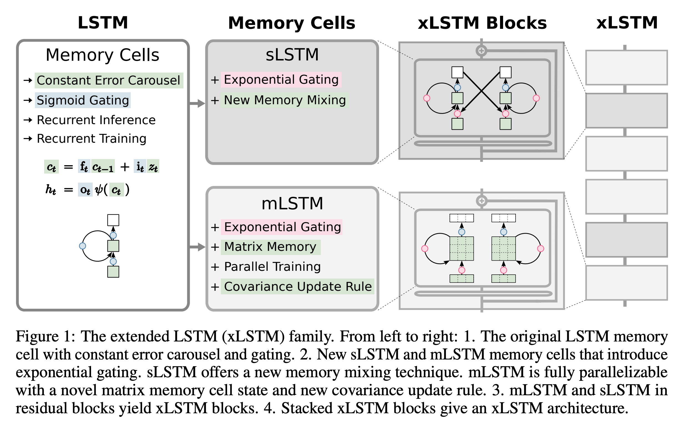
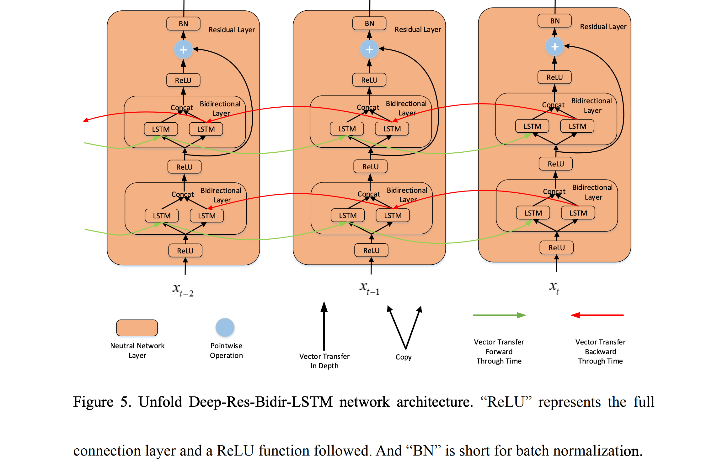

# Model Overview

## Explored Models

### Logistic Regression

| Name     | Type               | Params |
|----------|--------------------|--------|
| linear   | Linear             | 20.1 K |

### Convolutional Neural Network (CNN)
- **Paper**: [Convolutional Networks for Images, Speech, and Time-Series](https://citeseerx.ist.psu.edu/document?repid=rep1&type=pdf&doi=e26cc4a1c717653f323715d751c8dea7461aa105)
- **Implementation**: [cnn.py](/src/models/cnn.py)
- **Model Config**: [cnn.yaml](/configs/model/cnn.yaml)

1-dimensional convolutional neural networks (1D CNNs) are suitable for classifying human sensor activity because they can efficiently capture local patterns in time-series data, which is common in sensor readings. By applying convolutional filters along the time dimension, 1D CNNs can detect and learn important features such as spikes, trends, and periodicities that correspond to different activities. Additionally, 1D CNNs have fewer parameters compared to RNNs (i.e. LSTMs), making them faster to train and less prone to overfitting, which is beneficial for large-scale sensor data.

| Name  | Type              | Params |
|-------|-------------------|--------|
| conv1 | Conv1d            | 784    |
| conv2 | Conv1d            | 1.6 K  |
| conv3 | Conv1d            | 6.2 K  |
| pool  | AdaptiveMaxPool1d | 0      |
| fc1   | Linear            | 8.3 K  |
| fc2   | Linear            | 645    |

### Long Short-Term Memory Model (LSTM)
- **Paper**: [Long Short-term Memory](https://www.researchgate.net/publication/13853244_Long_Short-term_Memory)
- **Implementation**: [lstm.py](/src/models/lstm.py)
- **Model Config**: [lstm.yaml](/configs/model/lstm.yaml)

A simple LSTM is well-suited for Sensor Activity Recognition due to its ability to capture long-term dependencies and temporal patterns in sequential data, which is what sensor readings are. LSTMs maintain and update a memory cell that allows them to remember important information over long sequences, making them adept at modeling the temporal dynamics of sensor data. Additionally, LSTMs are relatively straightforward to implement and have proven robustness in various time-series prediction tasks, providing a reliable and efficient option for recognizing activities from sensor inputs.

| Name | Type   | Params |
|------|--------|--------|
| lstm | LSTM   | 206 K  |
| fc   | Linear | 645    |

### Extended Long Short-Term Memory (xLSTM)
- **Paper**: [xLSTM: Extended Long Short-Term Memory](https://arxiv.org/abs/2405.04517)
- **Implementation**: [x_lstm.py](/src/models/x_lstm.py)
- **Model Config**: [x_lstm.yaml](/configs/model/x_lstm.yaml)

**tl;dr**:
In the 90s, LSTMs introduced gating and the constant error carousel, forming the basis for the first Large Language Models (LLMs). The recently (May 2024) released paper of the xLSTM architecture explores scaling LSTMs to billions of parameters by introducing exponential gating with appropriate normalization and stabilization techniques, and modifying the LSTM memory structure into sLSTM (with scalar memory and update) and mLSTM (with matrix memory and covariance update rule). These modifications, integrated into residual block backbones and stacked into xLSTM architectures, enhance performance and scalability, making xLSTMs competitive with state-of-the-art Transformers and State Space Models.

Even though the xLSTM architecture was introduced in the context of Large Language Modelling, we propose that the xLSTM model's advanced memory structures and gating mechanisms make it also suitable for Sensor Activity Recognition, as they enable efficient handling of long-term dependencies and complex temporal patterns in sensor data. The improved stability and scalability of xLSTM can lead to more accurate and robust activity recognition, even in scenarios with large-scale and high-dimensional sensor inputs, which is what the data at hand consists of.

The core idea of the paper is to solve 3 problems that the current LSTM has:

- Inability to revise memory decisions: LSTMs struggle to update a stored value when a more similar vector is found during tasks such as nearest neighbor search. 
- Limited memory capacity: LSTMs compress information into scalar cell states, which can lead to poor performance in tasks such as predicting rare tokens.
- Lack of parallelizability due to memory mixing: The connections between hidden states in LSTMs force sequential processing, which limits parallelization and makes it slow.

To do this 2 new LSTM cells are introduced, the sLSTM and mLSTM. The combination of these in certain arrangement build up the xLSTM architecture (combined via residual connection).

Across the board exponential gating is introduced to both sLSTM and mLSTM. This is done to improve the stability of the model and to make it more scalable.
On top of that a new layer normalization, causal convolution, and residual connections are put into place. CausalConvolution ensure that causal relationship in time is not violated when processing time-series data. 
This implementation ensures that the convolution operation does not access future information, which is crucial for sequence prediction tasks. (comparable to masking in transformers)

**sLSTM Block**: This block contains a post-up projection. 
This basically means that the input is first summarized non-linearly in the original space and then mapped to a high-dimensional space. In this space the activation function (paper: gelu, challenge: selu) is applied and then the output is projected back to the original space. 
This can be thought of similar to how transformer apply a feed-forward layer after the attention layer. The hope here is that this allows the model to more easily change the whole sequence representation.

**mLSTM Block**: This block contains a pre-up projection. 
This means that the input is first linearly projected to a high-dimensional space. Now it summarizes the past non-linearly in this high-dimensional space. 
This is then again linearly projected back to the original space. The hope here is that this allows the model to be more computationally efficient. 
This can be though of similar to how state space models work, where the state is projected to a high-dimensional space, the dynamics are applied and then projected back to the original space.

The hyperparameters can be viewed in the [config file](/configs/model/x_lstm.yaml).

| Name       | Type               | Params |
|------------|--------------------|--------|
| model      | xLSTMBlockStack    | 24.1 K |
| classifier | Linear             | 85     |

### Deep Residual Bidirectional LSTM
- **Paper**: [Deep Residual Bidir-LSTM for Human Activity Recognition Using Wearable Sensors](https://arxiv.org/pdf/1708.08989v2)
- **Implementation**: [deep_res_bidir_lstm.py](/src/models/deep_res_bidir_lstm.py)
- **Model Config**: [deep_res_bidir_lstm.yaml](/configs/model/lsdeep_res_bidir_lstm.yaml)

The Deep Residual Bidirectional LSTM model introduced by Yu Zhao et al. is a deep learning architecture which tried to 
combine the powerful residual connection from a ResNet on top of a Bidirectional LSTM. 

The core idea introduces a Residual Layer which is build up by a Bidirectional LSTM layer and residual connections.

For this challenge the configuration used are 3 residual layers with each 2 Bidirectional LSTM layers. 

| Name           | Type               | Params |
|----------------|--------------------|--------|
| residual_layer | ResidualLayer      | 74.8 K |
| final_fc       | Linear             | 170    |

### Transformer
- **Paper**: [Attention Is All You Need](https://arxiv.org/abs/1706.03762)
- **Implementation**: [transformer.py](/src/models/transformer.py)
- **Model Config**: [transformer.yaml](/configs/model/transformer.yaml)

We propose that the self-attention mechanism, parallel processing capabilities, scalability, flexibility, and robust performance of Transformers as seen in numerous established applications can make a powerful choice for Sensor Activity Recognition.

On top of the transformer we add a classification head to predict the activity. Like in the paper we use 6 encoder layers with 8 attention heads, but with a hidden state of 128.

| Name                | Type               | Params |
|---------------------|--------------------|--------|
| positional_encoding | PositionalEncoding | 0      |
| transformer_encoder | TransformerEncoder | 1.2 M  |
| input_proj          | Linear             | 2.2 K  |
| output_proj         | Linear             | 645    |

## Comparison between Classical and Deep Learning Models

The data is split as follows:
- **Train**: 60% of complete data
- **Validation**: 20% of complete data
- **Holdout**: 20% of complete data

For comparison a few run  types are used:
- **main**: Uses Train/Validation split (60/20 of full data) so a 3:1 split. The hold out is not looked at this point. 
- **kfold**: We opted for a 5-fold cross-validation. The data used is Train and Validation, so 80% of the full data. Each fold is trained 64% of the full data (80% of 80%) and validated on 16% of the full data (20% of 80%).
- **refit**: The refit trains on both Train and Validation data (80% of full data) and tests on the holdout data (20% of full data).

Complementary to this markdown there are 3 Weights & Biases reports for the corresponding run types.

[Main](https://wandb.ai/lang-based-yappers/cdl1/reports/CDL1-Model-Overview-Main--Vmlldzo4MzM0NTc1)
[KFold](https://wandb.ai/lang-based-yappers/cdl1/reports/CDL1-Model-Overview-KFold--Vmlldzo4MzM0NTE3)
[Refit](https://wandb.ai/lang-based-yappers/cdl1/reports/CDL1-Model-Overview-Refit--Vmlldzo4MzM0NTMz)

The table below shows the performances of all the models on validation/test data for all run types.

| Model                                   | Metric      | Main  | KFold  | Refit  |
|-----------------------------------------|-------------|-------|--------|--------|
| Transformer                             | F1 Weighted | 0.935 | 0.88   | 0.9517 |
|                                         | Accuracy    | 0.930 | 0.8658 | 0.9279 |
| Multiclass Logistic Regression          | F1 Weighted | 0.815 | 0.6429 | 0.7316 |
|                                         | Accuracy    | 0.803 | 0.6387 | 0.7229 |
| Long Short-Term Memory (LSTM)           | F1 Weighted | 0.950 | 0.8104 | 0.961  |
|                                         | Accuracy    | 0.950 | 0.8104 | 0.9549 |
| Deep Residual Bidirectional LSTM        | F1 Weighted | 0.939 | 0.8253 | 0.9358 |
|                                         | Accuracy    | 0.936 | 0.816  | 0.9121 |
| Convolutional Neural Network            | F1 Weighted | 0.947 | 0.8921 | 0.9813 |
|                                         | Accuracy    | 0.951 | 0.8901 | 0.9715 |
| Extended Long Short-Term Memory (xLSTM) | F1 Weighted | 0.907 | 0.7969 | 0.8017 |
|                                         | Accuracy    | 0.874 | 0.7748 | 0.7569 |

Given the task at hand we can see that both simpel and complex models do very well on the task at hand. 
Especially transformer, CNN and Deep Residual Bidirectional LSTM are performing very well.

Interestingly the xLSTM model is not performing well on the refit or KFold, even though on main run type it seems to do not bad.

